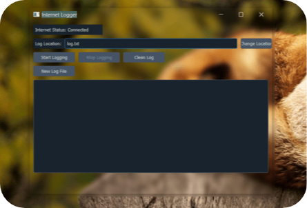

# Welcome to Foxy's Internet Logger!

A small open-source internet logger made using python an tkinter.

# Features
**Current**
- Quick install 💻 (Setup and run in less than a minute.)
- Modern UI 🔥
- Custom log file location 📂
- Easy to use 🤖
- Clean/start/stop logging right in app 🟢
- View log in app 📄

**Upcoming**
- ....
# How to install
There are 2 ways to install:
- Python (Local)
- Exe (Installed on your PC)

1. Python:
	Install all modules and then run `app.py`
2. App installer ( Recommend ):
	Go to [releases](https://github.com/FoxyIsCoding/InternetLogger/releases) and download `Setup.exe` and simply run.

## Screenshots

Screenshot of the app
## Issues
If you notice any bugs or missing features, you can let us know by opening an issue [here](https://github.com/FoxyIsCoding/InternetLogger/issues).
